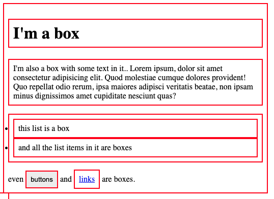
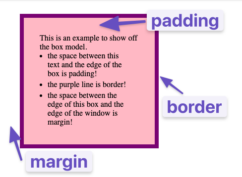

# Intro to CSS
## Adding CSS to HTML
- Before writing CSS, lets first learn how to link a CSS to our index.html. There are 3 ways to add CSS to HTML
    - External CSS: You write code in an independent stylesheet (e.g., styles.css) and reference it in your HTML page
    - Internal CSS: Also known as embedded CSS, this approach embeds the styling rules directly into a specific HTML file. The code sits inside the `<head>` section wrapper
    - Inline CSS: This style injects design rules right into individual HTML elements using the style attribute

## External CSS
- it involves creating a separate file for CSS and linking it inside the HTML.
```
<!-- index.html -->

<head>
  <link rel="stylesheet" href="styles.css">
</head>
```
- First, we add a void `<link>` element inside the `<head>` tags of the HTML file. The href attribute is the location of the CSS file (can be relative or absolute path or even a link to a hosted css file). 
- The `rel` attribute is required, and it specifies the relationship between the HTML file and the linked file.
- There is no rule towards naming the CSS files (like the home page html file has to be index.html). The CSS file can be named anything as long as the extension is .css
    - `style` or `styles` is most commonly used name

## Internal CSS
- Internal CSS (or embedded CSS) involves adding the CSS within the HTML file itself instead of creating a completely separate file.
- With the internal method, you place all the rules inside of a pair of opening and closing `<style>` tags, which are then placed inside of the opening and closing `<head>` tags
```
<head>
  <style>
    div {
      color: white;
      background-color: black;
    }

    p {
      color: red;
    }
  </style>
</head>
<body>
  ...
</body>
```

## Inline CSS
- Inline CSS makes it possible to add styles directly to HTML elements, though this method isn’t as recommended.
```
<body>
  <div style="color: white; background-color: black;">...</div>
</body>
```

## Basic Syntax
- At the most basic level, CSS is made up of various rules. Each rule is made up of a selector and a semicolon-separated list of declarations, with each of those declarations being made up of a property–value pair.

### Selector
- Selectors refer to the HTML elements to which CSS rules apply.

1. Universal selector
- The universal selector will select elements of every type (as in the whole document). 
- syntax for it is a simple asterisk
- example: every element would have the color: purple; style applied to it.
```
* {
  color: purple;
}
```

2. Type selectors
- A type selector (or element selector) will select all elements of the given element type, and the syntax is just the name of the element.
```
<!-- index.html -->

<div>Hello, World!</div>
<div>Hello again!</div>
<p>Hi...</p>
<div>Okay, bye.</div>
```
```
/* styles.css */

div {
  color: white;
}
```
- Here, all three `<div>` elements would be selected, while the `<p>` element wouldn’t be.

3. Class selectors
- Class selectors will select all elements with the given class, which is just an attribute you place on an HTML element. you can use the same class on as many elements as you want.
- Another thing you can do with the class attribute is to add multiple classes to a single element as a space-separated list, such as `class="alert-text severe-alert"`
    - Since whitespace is used to separate class names like this, you should never use spaces for multi-worded names
-  Here’s how you add a class to an HTML tag and select it in CSS:
```
<!-- index.html -->

<div class="alert-text">Please agree to our terms of service.</div>
```
```
/* styles.css */

.alert-text {
  color: red;
}
```
- Note the syntax for class selectors: a period immediately followed by the case-sensitive value of the class attribute.
***Class selectors won’t work if the class name begins with a number.***

4. ID selectors
- ID selectors are similar to class selectors. They select an element with the given ID, which is another attribute you place on an HTML element.
- The major difference between classes and IDs is that an element can only have **one** ID. It **cannot be repeated on a single page**
```
<!-- index.html -->

<div id="title">My Awesome 90's Page</div>
```
```
/* styles.css */

#title {
  background-color: red;
}
```
- For IDs, instead of a period, we use a hashtag immediately followed by the case-sensitive value of the ID attribute.
- A common pitfall is people overusing the ID attribute when they don’t necessarily need to, and when classes will suffice.
- Just like class selectors, ID selectors can’t start with a number. 

5. The grouping selector
- What if we have two groups of elements that share some of their style declarations? e.g:
```
.read {
  color: white;
  background-color: black;
  /* several unique declarations */
}

.unread {
  color: white;
  background-color: black;
  /* several unique declarations */
}
```
- Both our `.read` and `.unread` class selectors share the `color: white;` and `background-color: black;` declarations, but otherwise have several of their own unique declarations.
- To cut down on the repetition, we can group these two selectors together as a comma-separated list:
```
.read,
.unread {
  color: white;
  background-color: black;
}

.read {
  /* several unique declarations */
}

.unread {
  /* several unique declarations */
}
```
- Both of the examples above (with and without grouping) will have the same result, but the second example reduces the repetition of declarations and makes it easier to edit.

6. Chaining selectors
- Another way to use selectors is to chain them as a list without any separation.

```
<!-- index.html -->
<div>
  <div class="subsection header">Latest Posts</div>
  <p class="subsection preview">This is where a preview for a post might go.</p>
</div>
```
- We have two elements with the subsection class. but what if we only want to apply a separate rule to the element that also has `header` as a second class? we could chain both the class selectors together in our CSS
```
.subsection.header {
  color: red;
}
```
- What `.subsection.header` does is it selects any element that has both the `subsection` and `header` classes.
- Notice how there isn’t any space between the 2 class selectors
- This syntax basically works for chaining any combination of selectors, except for chaining more than one type selector.
```
.subsection.header {
  color: red;
}

.subsection#preview {
  color: blue;
}
```
- In general, you can’t chain more than one type selector since an element can’t be two different types at once.

7. Descendant combinator
- Combinators allow us to combine multiple selectors differently than either grouping or chaining them.
- A descendant combinator will only cause elements that match the last selector to be selected if they also have an ancestor (parent, grandparent, etc.) that matches the previous selector.
- child will only be selected if it is nested inside ancestor
```
<!-- index.html -->

<div class="ancestor">
  <div class="contents">
    <div class="contents"></div>
  </div>
</div>

<div class="contents"></div>
```
```
/* styles.css */

.ancestor .contents {
  /* some declarations */
}
```
- In the above example, the first two elements with the contents class would be selected, but the last element wouldn’t be.

## Properties to get started with
- all properties will have a default initial value, which will be used if neither you nor the browser has set a different value

1. Color and background-color
- The `color` property sets an element’s text color, while background-color sets, well, the `background color` of an element.
- Both of these properties can accept one of several kinds of values.
    - A common one is a keyword, such as an actual color name like `red` or the `transparent` 
    - They also accept HEX, RGB, and HSL values
    - rgba(red, green, blue, alpha) - The alpha parameter is a number between 0.0 (fully transparent) and 1.0 (fully opaque).

2. Typography basics and text-align
- `font-family` can be a single value or a comma-separated list of values that determine what font an element uses
    - Each font will fall into one of two categories, either a “font family name” like "Times New Roman" (we use quotes due to the whitespace between words) or a “generic family name” like serif (generic family names never use quotes).
    - If a browser cannot find or does not support the first font in a list, it will use the next one, then the next one and so on until it finds a supported and valid font. 
    - e.g. `font-family: "Times New Roman", serif;`
- `font-size` will, as the property name suggests, set the size of the font. he value should not contain any whitespace, e.g. `font-size: 22px`
- `font-weight` affects the boldness of text, assuming the font supports the specified weight. 
    - This value can be a keyword, e.g. `font-weight: bold`, or a number between 1 and 1000, e.g. f`ont-weight: 700` (the equivalent of bold). 
    - Usually, the numeric values will be in increments of 100 up to 900, though this will depend on the font.
- `text-align` will align text horizontally within an element, and you can use the common keywords you may have come across in word processors as the value for this property, e.g. `text-align: center`

3. Image height and width
- By default, an `` element’s height and width values will be the same as the actual image file’s height and width.
- If you wanted to adjust the size of the image without causing it to lose its proportions, you would set either the `height` or `width` property to a specific value and set the other property to `auto`
```
img {
  height: auto;
  width: 500px;
}
```
- When these values aren’t included, if an image takes longer to load than the rest of the page contents, it won’t take up any space on the page at first but will suddenly cause a drastic shift of the other page contents once it does load in. Explicitly stating a height and width prevents this from happening.

# The Cascade
## What is cascade?
- Sometimes we may have rules that conflict with one another,so if you end up with some unexpected behavior like incorrect color, font etc, it’s either because of these default styles, not understanding how a property works, or not understanding this little thing called the cascade.
- The cascade is what determines which rules actually get applied to our HTML. There are different factors that the cascade uses to determine this.

1. Specificity
- A CSS declaration that is more specific will take precedence over less specific ones
- Inline styles, have the highest specificity compared to selectors, while each type of selector has its own specificity level that contributes to how specific a declaration is. 
    - ID selectors (most specific selector)
    - Class selectors
    - Type selectors
- Specificity will only be taken into account when an element has multiple, conflicting declarations targeting it
```
<!-- index.html -->

<div class="main">
  <div class="list subsection">Red text</div>
</div>
```
```
/* rule 1 */
.subsection {
  color: blue;
}

/* rule 2 */
.main .list {
  color: red;
}
```
- In the example above, both rules are using only class selectors, but rule 2 is more specific because it is using more class selectors, so the color: red declaration would take precedence.

2. Inheritance
- Inheritance refers to certain CSS properties that, when applied to an element, are inherited by that element’s descendants, even if we don’t explicitly write a rule for those descendants.
- Typography-based properties (color, font-size, font-family, etc.) are usually inherited.
- So if a parent selector has a property defined, it is inherited by child selector unless the child selector definition has that same property defined for itself

3. Rule order
- Let’s say that after every other factor has been taken into account, there are still multiple conflicting rules targeting an element. How does the cascade determine which rule to apply?
- Whichever rule was the last defined is the winner.
```
/* styles.css */

.alert {
  color: red;
}

.warning {
  color: yellow;
}
```
- For an element that has both the alert and warning classes, the cascade would run through every other factor, including inheritance (none here) and specificity (neither rule is more specific than the other).
- Since the .warning rule was the last one defined, and no other factor was able to determine which rule to apply, it’s the one that gets applied to the element.

[Reference for Cascade](https://2019.wattenberger.com/blog/css-cascade)

# Inspecting HTML and CSS
## The inspector
- To open up the inspector, you can right-click on any element of a webpage and click “Inspect” or press F12. This will show the HTML and CSS code for the highlighted elements of page

## Inspecting elements
- In the Elements panel, you can see the entire HTML structure of your page. You can click on any of the elements in this panel to select that specific element. 
- Alternatively, you can click on the upper-left “element select” icon, then hover over any element on the page.
- When an element is selected, the Styles tab will show all the currently applied styles, as well as any styles that are being overwritten (indicated by a strikethrough of the text).

## Testing styles in the inspector
- The Styles panel also allows you to edit styles directly in the browser. You can click inside of any individual selector to add a new rule or click on an existing attribute or value to alter it.
- When doing so, the webpage responds with the changes in real-time. 
- This won’t affect the source code in your text editor, but it is extremely useful for quickly testing out various attributes and values without needing to reload the page over and over again.

[Chrome Dev Tools](https://developer.chrome.com/docs/devtools/)

# The Box Model
- The most important skills you need to master with CSS are positioning and layout. Changing fonts and colors is a crucial skill, but being able to put things exactly where you want them on a webpage is even more crucial.
- Every single thing on a webpage is a rectangular box. These boxes can have other boxes in them and can sit alongside one another.
- You can get a rough idea of how this works by applying an outline to every element on the page like this:
```
* {
  outline: 2px solid red;
}
```

- In the end, laying out a webpage and positioning all its elements is deciding how you are going to nest and stack these boxes.
- The only real complication here is that there are many ways to manipulate the size of these boxes, and the space between them, using `padding`, `border`, and `margin`
    - padding: increases the space between the border of a box and the content of the box.
    - border: adds space (even if it’s only a pixel or two) between the margin and the padding.
    - margin: increases the space between the borders of a box and the borders of adjacent boxes.

- we can modify the box calculation by changing the box-sizing property
- Normally the padding and border sizes defined are added on top of the defined height and width. e.g. if height and width is defined to be as 100 x 100. Then you add padding of 20 and border of 30 so the total element size becomes (100 + 20 + 30). So essentially padding and border are added on top of the defined height and weight
- But if we set `box-sizing: border-box` then in that case the defined height and weight becomes the final size of the element. Any added padding and borders are adjust inside of the box instead of on top of it

## References
- [Learn CSS Box Model In 8 Minutes](https://www.youtube.com/watch?v=rIO5326FgPE)
- [box-sizing: border-box (EASY!)](https://www.youtube.com/watch?v=HdZHcFWcAd8)
- [MDN’s lesson on the box model](https://developer.mozilla.org/en-US/docs/Learn/CSS/Building_blocks/The_box_model)
- [CSS Tricks page on margins](https://css-tricks.com/almanac/properties/m/margin/)

# Block and Inline

## Block vs Inline
- CSS has two box types: `block` and `inline` boxes, which determine element behavior and interaction.
- The display property controls how HTML elements appear on the webpage. 
- Most of the elements are block elements. In other words, their default style is `display: block`
- By default, block elements will appear on the page stacked atop each other, each new element starting on a new line.
- Inline elements, however, do not start on a new line. They appear in line with whatever elements they are placed beside.
    -  clear example of an inline element is a link, or <a> tag. If you stick one of these in the middle of a paragraph of text, the link will behave like a part of the paragraph.
    - In general, you do **not** want to try to put extra padding or margin on inline elements.

## The middle ground inline-block
- Inline-block elements behave like inline elements, but with block-style padding and margin. `display: inline-block`

## Divs and Spans
- When building a web page, not every piece of content has a specific semantic tag.
- Sometimes, you just need a container you can style or position! That’s where `div` and `span` come in.
- A `div` is a generic **block-level container**. 
    - It behaves like a rectangular section that, by default, stretches across the full width of its parent and starts on a new line.
    - Typically, you would use a div to group related elements inside page components, such as grouping cards, sections, sidebars, or navigation bars.
    - In this case, when you wrap content in a div and give it a class or id, you create a convenient hook for CSS layout and styling!
- A `span` is a generic **inline container**.
    -  It sits inside a line of text and only takes up as much space as its content.
    - Unlike div, it does not start on a new line. 
    - You use span when you want to style or target just part of a sentence.
    - For example, when you want to highlight a single word or attach a tooltip to a phrase, you can wrap it in a span then add a class or id so CSS can find and manipulate it.
- You can use `div` when you’re grouping and positioning bigger blocks of content, and `span` when you’re styling or scripting small pieces inside a line.

## References
- [“Normal Flow” from MDN](https://developer.mozilla.org/en-US/docs/Learn_web_development/Core/CSS_layout/Introduction)
- [“HTML Block and Inline Elements”](https://www.w3schools.com/html/html_blocks.asp)
- [“Inline vs Inline-block Display in CSS”](https://www.digitalocean.com/community/tutorials/css-display-inline-vs-inline-block)
- [CSS Fonts](https://www.w3schools.com/Css/css_font.asp)
- [CSS Web Safe Fonts](https://www.w3schools.com/cssref/css_websafe_fonts.php)
