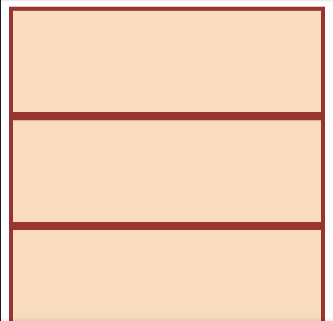
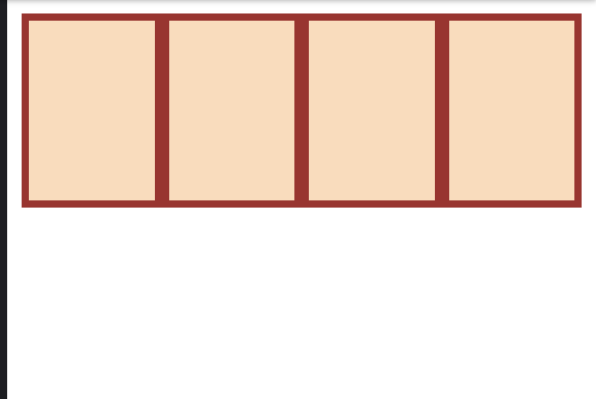
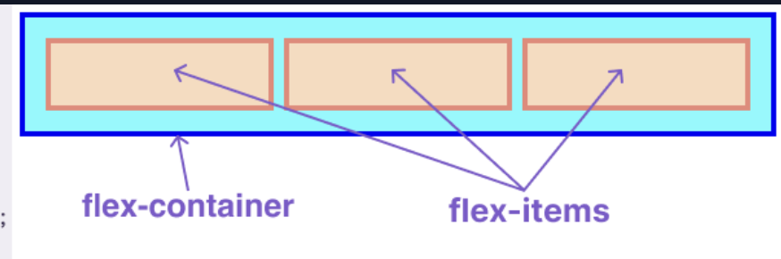
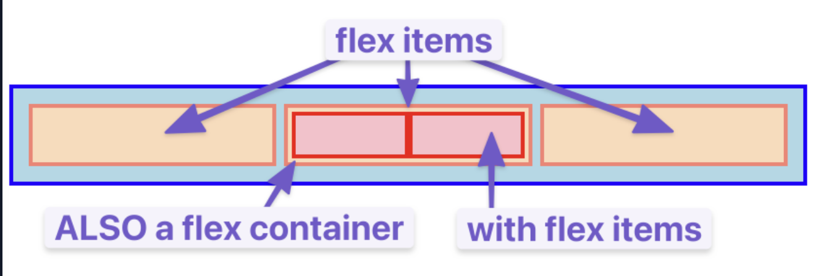
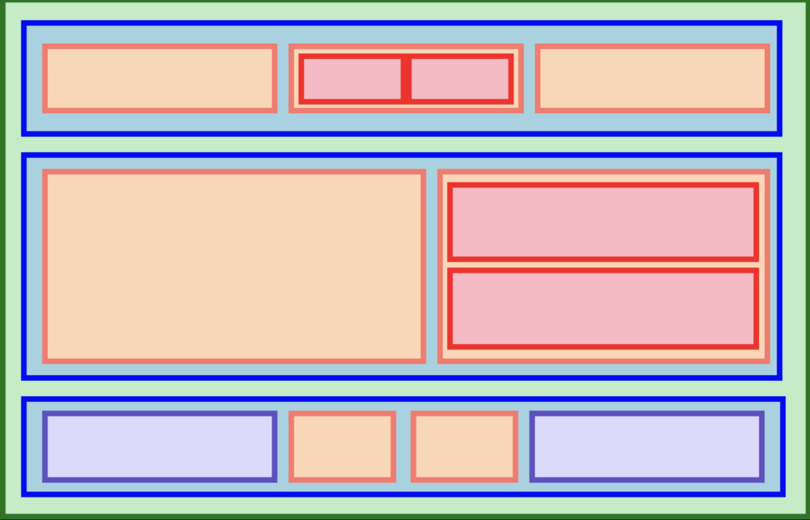
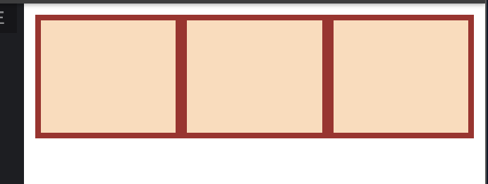
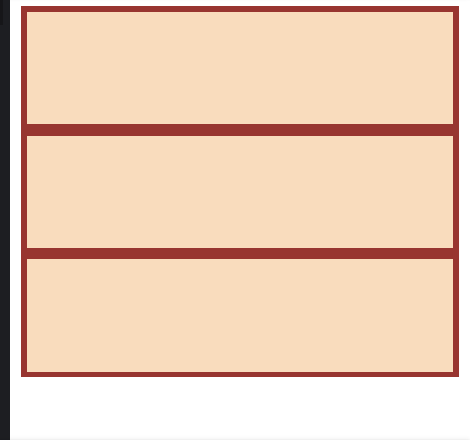
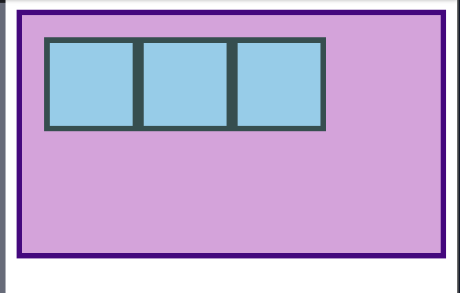
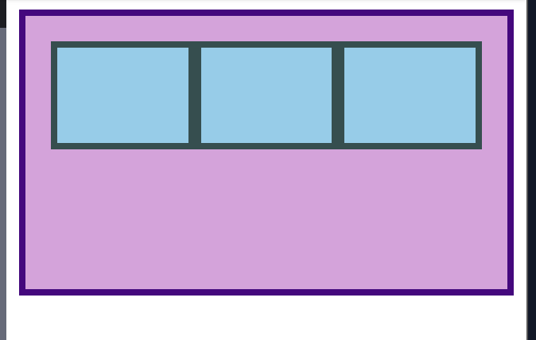
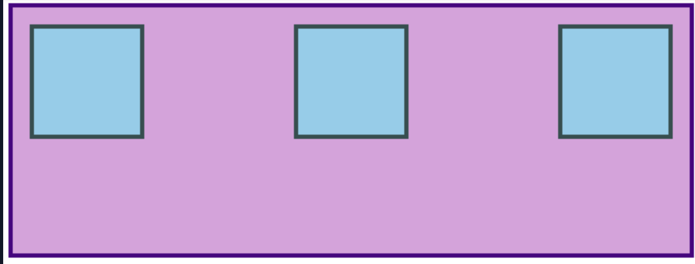

- If something isn’t behaving the way you expect, inspecting it in the developer tools should be your first step every time.

# What is flexbox
- Flexbox is a way to arrange items into rows or columns. These items will flex (i.e. grow or shrink) based on some rules that you can define. 
- Assume the code is:
```
<!-- index.html -->
<div class="flex-container">
  <div class="one"></div>
  <div class="two"></div>
  <div class="three"></div>
  <div class="four"></div>
</div>
```
```
/*style.css*/
.flex-container div {
  background: peachpuff;
  border: 4px solid brown;
  height: 100px;
}
```
The output will be:

- This is expected as div tags behave as block containers and each div starts on a new line.
- Now assume we update the css to:
```
/*style.css*/
.flex-container {
  display: flex;
}

/* this selector selects all divs inside of .flex-container */
.flex-container div {
  background: peachpuff;
  border: 4px solid brown;
  height: 100px;
  flex: 1;
}
```
The output now changes to:

- The div containers are now stacked horizontally as if they are inline

## Flex containers and flex items
- flexbox is not just a single CSS property but a whole toolbox of properties that you can use to put things where you need them
- Some of these properties belong on the *`flex container`*, while some go on the *`flex items`*
- **A flex container is any element that has `display: flex` on it. A flex item is any element that lives directly inside of a flex container.**

- A flex item in one container be a flex container for other flex items

- Creating and nesting multiple flex containers and items is the primary way we will be building up complex layouts.
- The following image was achieved using only flexbox to arrange, size, and place the various elements.


# Growing and Shrinking
- In the above updated code for CSS, we made 2 modifications
    - for the parent div class we declared `display: flex;` making it a flex container and thus automatically all the children elements flex items
    - then we added `flex: 1;` at the type selector
- The `flex` declaration is actually a shorthand for 3 properties that you can set on a flex item. These properties affect how flex items size themselves within their container. 

***Shorthand properties are CSS properties that let you set the values of multiple other CSS properties simultaneously.***

- In this case, flex is actually a shorthand for `flex-grow`, `flex-shrink` and `flex-basis`.
    - So when we declared `flex: 1;` -> equated to `flex-grow: 1;`, `;flex-shrink: 1;` and **`flex-basis: 0;`**

## Flex-grow
- `flex-grow` expects a single number as its value, and that number is used as the flex-item’s “growth factor”
- When we applied `flex: 1` to every div inside our container, <u>we were telling every div to grow the same amount.</u>
- The result of this is that every div ends up the exact same size.
- If we instead add `flex: 2` to just one of the divs, then that div would grow to 2x the size of the others.

## Flex-shrink
- `flex-shrink` is similar to `flex-grow`, but sets the “shrink factor” of a flex item. `flex-shrink` only ends up being applied *if the size of all flex items is larger than their parent container.*
- For example, if our 3 divs had a width declaration like: width: 100px, and .flex-container was smaller than 300px, our divs would have to shrink to fit.
- The default shrink factor is `flex-shrink: 1`, which means all items will shrink evenly. 
- If you do ***not*** want an item to shrink then you can specify `flex-shrink: 0;`. 

***An important implication to notice here is that when you specify flex-grow or flex-shrink, flex items do not necessarily respect your given values for width. when their parent is big enough, they grow to fill it. Likewise, when the parent is too small, the default behavior is for them to shrink to fit.***

## Flex-basis
- The `flex-basis` property in CSS sets the initial main size of a flex item before any space is distributed through `flex-grow` or `flex-shrink`
- The actual default value for `flex-basis` is `auto`, but when you specify `flex: 1` on an element, it interprets that as `flex: 1 1 0;`. 

- `flex: auto` is one of the shorthands of flex. When auto is defined as a flex keyword it is equivalent to the values of `flex-grow: 1`, `flex-shrink: 1` and `flex-basis: auto` or to `flex: 1 1 auto`
- ***Note that `flex: auto` is not the default value when using the flex shorthand***

## References
- [W3C’s “7.1.1 Basic Values of ‘flex’”](https://www.w3.org/TR/css-flexbox-1/#flex-common)
- [MDN’s documentation on flex](https://developer.mozilla.org/en-US/docs/Web/CSS/Reference/Properties/flex)

# Axes
- The most confusing thing about flexbox is that it can work either horizontally or vertically, and some rules change a bit depending on which direction you are working with. 
- The default direction for a flex container is horizontal, or `row`, but you can change the direction to vertical, or `column`
```
.flex-container {
  flex-direction: column;
}
```
- No matter which direction you’re using, you need to think of your flex-containers as having 2 axes. It is the direction of these axes that changes when the `flex-direction` is changed.
    - main axis
        - `flex-direction: row` (default): puts the main axis horizontal (left-to-right)
            - The items are arranged horizontally
            - the `flex-basis` refers to width (which is why changes happen along the left-right axis)
            
        - `flex-direction: column`: puts the main axis vertical (top-to-bottom)
            - The items are stacked vertically
            - the `flex-basis` refers to height (which is why changes happen along the top-bottom axis)
            
    - cross axis
        - The cross axis in a CSS Flexbox layout is the imaginary line that runs perpendicular (at a 90-degree angle) to the main axis

## References
- [MDN docs for flex-direction](https://developer.mozilla.org/en-US/docs/Web/CSS/Reference/Properties/flex-direction)

# Alignment
- `flex: 1` makes the items grow or shrink equally to fill all of the available space.
- Very often, however, this is not the desired effect. Flex is also very useful for arranging items that have a specific size.
- Let us take the following code as example:
```
<!-- index.html -->
<div class="container">
  <div class="item"></div>
  <div class="item"></div>
  <div class="item"></div>
</div>
```
```
.container {
  height: 140px;
  padding: 16px;
  background: plum;
  border: 4px solid indigo;
  display: flex;
}

.item {
  width: 60px;
  height: 60px;
  border: 4px solid darkslategray;
  background: skyblue;
}
```
- If you notice carefully in the CSS code, the parent div tag has been initiated as `display: flex` making it a container and the child div classes an item
- However the flex items have **not** been given any `flex` values. So the current output is 

- if we add `flex: 1;` to the child div class (.item), the flex items would grow *equally* to fill the space
. 

- BUTTTTT, what if we wanted them to stay the same width, but distribute themselves differently inside the container?
    - We can do it by adding `justify-content: space-between` to the **flex container** (in this case .container) and not flex item (.item). This would give
    . 

- `justify-content` aligns items across the **main axis**. The values available for this property are: 
    - flex-start (Default) — Items align closely together toward the start edge of the container.
    - flex-end — Items align closely together toward the end edge of the container.
    - start — Items align toward the starting edge of the writing mode direction.
    - end — Items align toward the ending edge of the writing mode direction.
    - center — Items cluster together in the absolute center of the container.
    - left — Items align toward the left edge of the container.
    - right — Items align toward the right edge of the container.
    - space-between — Items spread out evenly; first item pins to the start edge, last item pins to the end edge.
    - space-around — Items spread out evenly with equal space around each individual item, resulting in double spacing between internal items.
    - space-evenly — Items spread out evenly so the gap between any two items, and the space to the edges, is exactly identical. 

- To change the placement of items along the **cross axis** use `align-items`. The values are:
    - stretch: Stretches items to fill the container height or width along the cross-axis.
    - flex-start / start: Packs items to the start edge of the cross-axis.
    - flex-end / end: Packs items to the end edge of the cross-axis.
    - center: Centers items in the middle of the cross-axis.
    - baseline: Aligns items so that their text baselines line up together. 

- Because `justify-content` and `align-items` are based on the main and cross axis of your container, their behavior changes when you change the `flex-direction` of a flex-container. 

## Gap
- One very useful feature of flex is the `gap` property. Setting `gap` on a **flex container** adds a specified space between flex items (similar to adding margins)

## Reference
- [Interactive Guide to Flexbox](https://www.joshwcomeau.com/css/interactive-guide-to-flexbox/)
- [CSS Tricks “Guide to Flexbox”](https://css-tricks.com/snippets/css/a-guide-to-flexbox/)
- [ Flexbox Froggy](https://flexboxfroggy.com/)