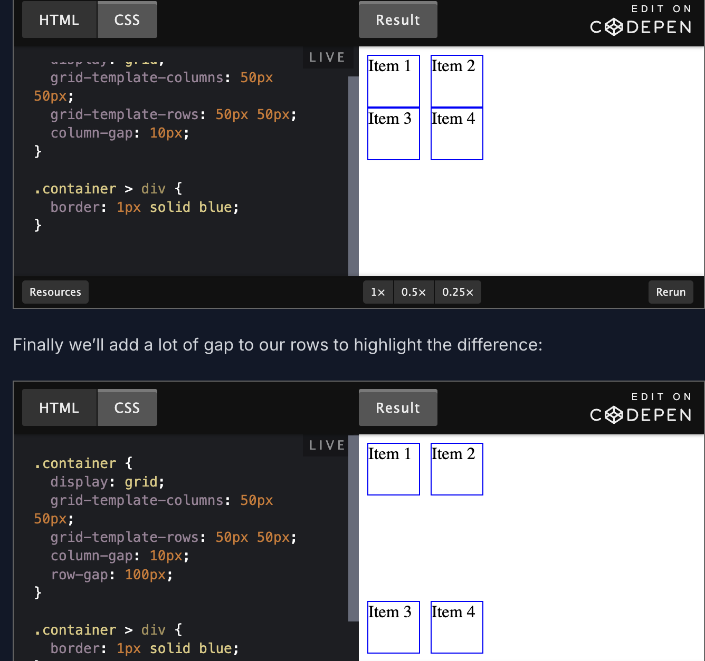
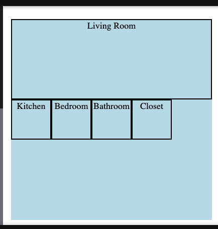
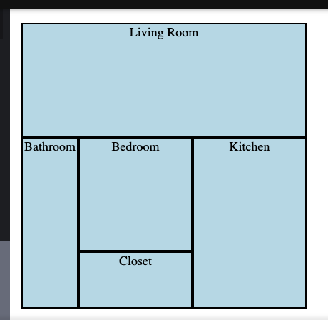

## A look back at flex
- The Flex lessons covered positioning items along the two flex axes (main and cross) and how to set their flex alignment. 
(flex direction: row/column, justify-content, align-items). You also learned how to make your flex items grow, shrink or change their size. This is the real beauty of Flexbox as items can, well, “flex” to stretch out or shrink down.
- For two-dimensional layouts, you learned a little bit about flex-wrap, which allows you to take your flex items and wrap them to the next line. This can be done with either a row that wraps to another row, or a column that wraps to another column.
- *While Flexbox allows you to build a layout of rows and columns together, it isn’t always easy.*

**But setting up a two-dimensional layout of cards would be much easier using CSS Grid**

## What is a grid?
- Grid and Flex both use parent containers with child items. They have similar property names for alignment and positioning.

## Creating a Grid
### Grid container
- We can think about CSS Grid in terms of a container and items. When you make an element a grid container, it will “contain” the whole grid. 
- In CSS, an element is turned into a grid container with the property `display: grid` or `display: inline-grid`
```
<div class="container">
  <div>Item 1</div>
  <div>Item 2</div>
  <div>Item 3</div>
  <div>Item 4</div>
</div>

// CSS
.container {
  display: grid;
}
```
- In this example, the parent element marked `class="container"` becomes a grid container and each of the direct child elements below it automatically become grid items.
***Note that only the direct child elements will become grid items here. Grandparent element will not become a gird item***
- grid items can also be grid containers.
- Now that we have our grid container with several grid items all set up, it’s time to specify our columns and rows. 
- This will define the grid track (the space between lines on a grid). So we could set a column track to give us space between our columns and a row track to give us space between our rows.
- The properties `grid-template-columns` (no of values = no of columns) and `grid-template-rows` (no of values = no of rows) make defining column and row tracks easy.
```
<div class="container">
  <div>Item 1</div>
  <div>Item 2</div>
  <div>Item 3</div>
  <div>Item 4</div>
</div>

//CSS
.container {
  display: grid;
  grid-template-columns: 50px 50px; // 2 cols
  grid-template-rows: 50px 50px; // 2 rows
}
```
- If we want to add more columns or rows to our grid, we can define these values to make another track. Let’s say we wanted to add a third column to our example
```.container {
  display: grid;
  grid-template-columns: 50px 50px 50px; //3 columns
  grid-template-rows: 50px 50px; //2 rows
}
```
- In our previous example, we can replace the properties for `grid-template-rows` and `grid-template-columns` with the shorthand `grid-template` property. Here we can define our rows and columns all at once.
- For this property, rows are defined before the slash and columns are defined after the slash
```
/* styles.css */

.container {
  display: grid;
  grid-template: 50px 50px / 50px 50px 50px;
}
```
- Columns and rows don’t have to share all the same values either. 

## Explicit vs implicit grid
- When we use the `grid-template-columns` and `grid-template-rows` properties, we are explicitly defining grid tracks to lay out our grid items. 
- But when the grid needs more tracks for extra content, it will implicitly define new grid tracks
- Additionally, the size values established from our `grid-template-columns` or `grid-template-rows` properties are not carried over into these implicit grid tracks. But we can define values for the implicit grid tracks.
- We can set the implicit grid track sizes using the `grid-auto-rows` and `grid-auto-columns` properties.

```
/* styles.css - Let’s say we want any new rows to stay the same value as our explicit row track sizes: */

.container {
  display: grid;
  grid-template-columns: 50px 50px;
  grid-template-rows: 50px 50px;
  grid-auto-rows: 50px;
}
```
- By default, CSS Grid will add additional content with implicit rows. This means the extra elements would keep being added further down the grid in a vertical fashion

## Gap
- The gap between grid rows and columns is known as the gutter or alley. Gap sizes can be adjusted separately for rows and columns using the `column-gap` and `row-gap` properties
- Furthermore, we can use a shorthand property called `gap` to set both `row-gap` and `column-gap`.
- We can add borders around our grid items so that it is easier to observe
```
// HTML
<div class="container">
  <div>Item 1</div>
  <div>Item 2</div>
  <div>Item 3</div>
  <div>Item 4</div>
</div>

//CSS
.container {
  display: grid;
  grid-template-columns: 50px 50px;
  grid-template-rows: 50px 50px;
}

.container > div {
  border: 1px solid blue;
}
```


## Positioning Grid Elements
- By default, each child element of a grid container will occupy one cell.
- when you define the `grid-template-rows` and `grid-template-columns` essentially they are combination of lines. These lines can be used to change the positioning of items in a grid container, if you want an item to occupy more than 1 cell.

```
//Create a 5x5 grid and define home layout
//html
<div class="container">
  <div class="room" id="living-room">Living Room</div>
  <div class="room" id="kitchen">Kitchen</div>
  <div class="room" id="bedroom">Bedroom</div>
  <div class="room" id="bathroom">Bathroom</div>
  <div class="room" id="closet">Closet</div>
</div>

//css
.container {
  display: inline-grid;
  grid-template: 40px 40px 40px 40px 40px / 40px 40px 40px 40px 40px;
  background-color: lightblue; 
}

.room {
  border: 1px solid;
  font-size: 50%;
  text-align: center;
}

#living-room {
  grid-column-start: 1;
  grid-column-end: 6;
  grid-row-start: 1;
  grid-row-end: 3;
}
```

- So here using `grid-column-start` and `grid-column-end`(and rows), we were able to define how many cells the item would occupy, whereas the rest defaulted to 1 cell per items
- These properties allow us to use our existing grid lines to tell items how many rows and columns each item should span across

```
.container {
  display: inline-grid;
  grid-template: 40px 40px 40px 40px 40px / 40px 40px 40px 40px 40px;
  background-color: lightblue; 
}

.room {
  border: 1px solid;
  font-size: 50%;
  text-align: center;
}

#living-room {
  grid-column-start: 1;
  grid-column-end: 6;
  grid-row-start: 1;
  grid-row-end: 3;
}

#kitchen {
  grid-column: 4 / 6;
  grid-row: 3 / 6;
}

#bedroom {
  grid-column-start: 2;
  grid-column-end: 4;
  grid-row-start: 3;
  grid-row-end: 5;
}

#bathroom {
  grid-column-start: 1;
  grid-column-end: 2;
  grid-row-start: 3;
  grid-row-end: 6;
}

#closet {
  grid-column-start: 2;
  grid-column-end: 4;
  grid-row-start: 5;
  grid-row-end: 6;
}
```

- `grid-column` is just a combination of `grid-column-start` and `grid-column-end` with a slash between the two values. Similar for `grid-row`

### grid area
- There is an even shorter shorthand for positioning grid items with start and end lines. You can combine `grid-row-start` / `grid-column-start` / `grid-row-end` / `grid-column-end` into one line using `grid-area`.
`#living-room { grid-area: 1 / 1 / 3 / 6;}`
- If it is too confusing, stick to grid-column and grid-row, or define all individual values as needed.
- Another use case is that instead of defining the values, we can use `grid-area` to assign a name to the item
`#living-room {grid-area: living-room;}`
- and then use `grid-template-areas` to define the layout using these named values. We can even use `.` to indicate empty cells.
```
.container {
  display: inline-grid;
  grid-template: 40px 40px 40px 40px 40px / 40px 40px 40px 40px 40px;
  background-color: lightblue; 
  grid-template-areas:
    "living-room living-room living-room living-room living-room"
    "living-room living-room living-room living-room living-room"
    "bedroom bedroom bathroom kitchen kitchen"
    "bedroom bedroom bathroom kitchen kitchen"
    "closet closet bathroom kitchen ."    
}

.room {
  border: 1px solid;
  font-size: 50%;
  text-align: center;
}

#living-room {
   grid-area:  living-room;
}

#kitchen {
  grid-area: kitchen;
}

#bedroom {
  grid-area: bedroom;
}

#bathroom {
  grid-area: bathroom;
}

#closet {
  grid-area: closet;
}
```

## References
- [CSS-Tricks Grid Layout Guide](https://css-tricks.com/css-grid-layout-guide/)
- [video on implicit vs explicit tracks](https://www.youtube.com/watch?v=8_153Zz4YI8&ab_channel=WesBos)
- [inspecting CSS Grid in Chrome DevTools](https://developer.chrome.com/docs/devtools/css/grid/)
- [Line-based Placement with CSS Grid](https://developer.mozilla.org/en-US/docs/Web/CSS/CSS_Grid_Layout/Line-based_Placement_with_CSS_Grid)
- [CSS Grid Garden](https://cssgridgarden.com/)